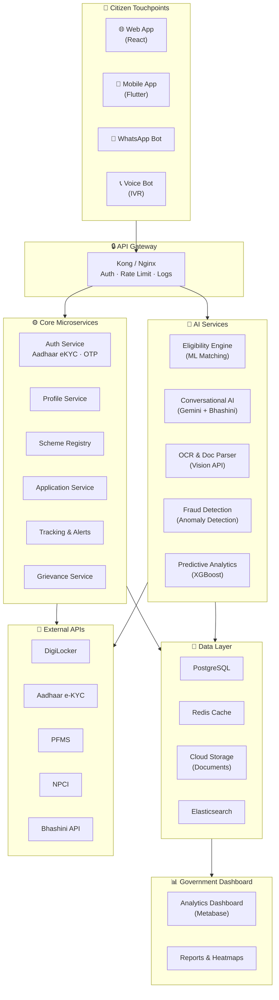
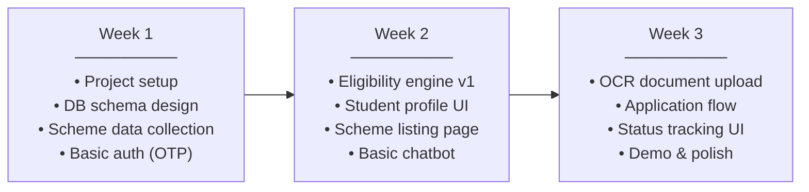
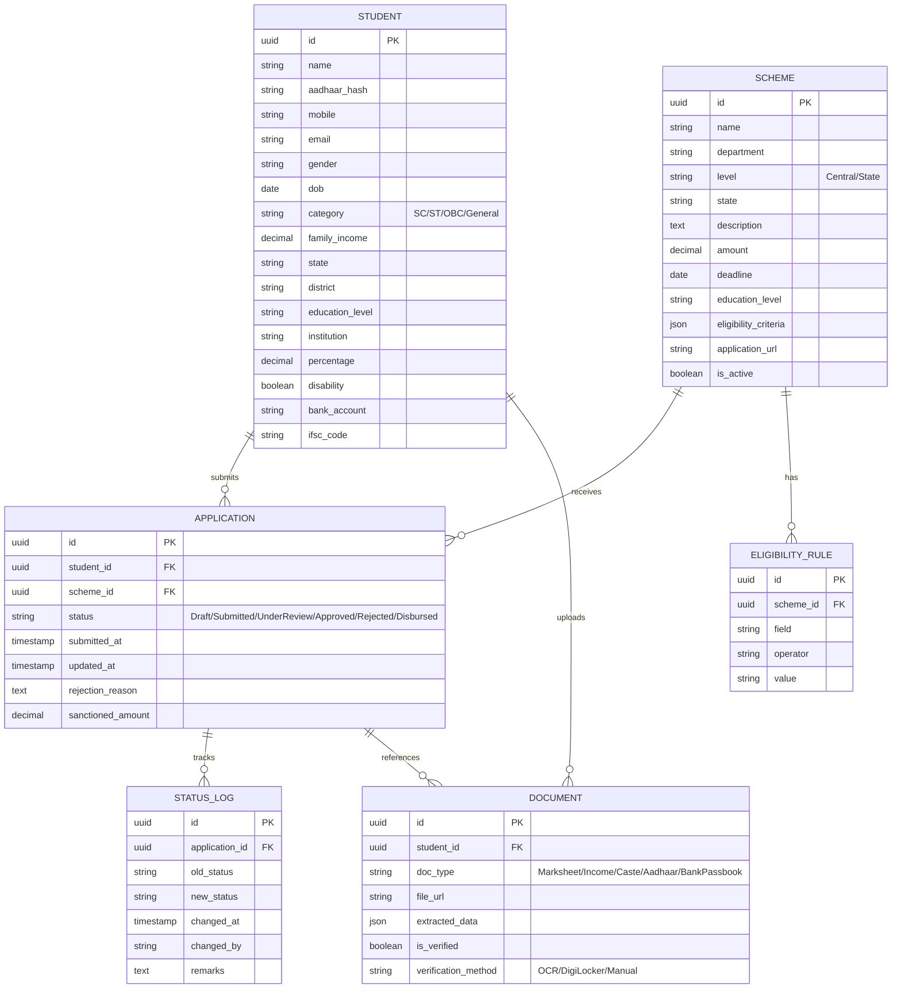

# 🎓 AI-Powered Scholarship Platform — "ScholarSetu"
## AI Innovation for Public Services & Citizen-Centric Governance

---

## 1. Problem Statement — Why Scholarships?

### Current Pain Points in India's Scholarship Ecosystem

| Problem | Impact |
|---|---|
| **Fragmented portals** | 50+ central & state schemes across different websites; citizens don't know what they're eligible for |
| **Complex applications** | Long forms, confusing eligibility criteria, language barriers |
| **Document verification bottleneck** | Manual verification of certificates causes 2-6 month delays |
| **Lack of awareness** | 40%+ eligible students never apply because they don't know a scheme exists |
| **Duplicate/fraudulent claims** | No cross-verification across schemes leads to fund leakage |
| **No tracking or transparency** | Applicants have zero visibility into their application status or rejection reasons |
| **Rural & vernacular gap** | Platforms are English-first; rural students with low digital literacy are left behind |

### Our Vision
> **"Every eligible student in India should discover, apply for, and receive scholarships — in their own language, with zero friction."**

---

## 2. Solution Overview — ScholarSetu

**ScholarSetu** is an AI-powered, citizen-centric scholarship discovery, application, and tracking platform that:

1. **Discovers** — Matches students to eligible scholarships using AI profiling
2. **Simplifies** — Auto-fills forms using OCR & document parsing
3. **Verifies** — Uses AI + blockchain for instant document verification
4. **Communicates** — Multilingual voice & chat bot for guidance in 10+ Indian languages
5. **Tracks** — Real-time application tracking with proactive notifications
6. **Predicts** — Uses analytics to identify at-risk students and recommend interventions

---

## 3. Key Features

### 🔹 Feature 1: AI Scholarship Discovery Engine
> *"Tell me about yourself, we'll find your scholarships"*

- **Smart Profiling**: Student fills a simple unified profile (income, caste, state, course, disability, gender, merit)
- **Eligibility Matching**: AI engine matches profile against 500+ scholarship schemes (central, state, private)
- **Ranked Recommendations**: Scholarships ranked by match score, deadline urgency, and award amount
- **Proactive Alerts**: Push notifications when new schemes match the student's profile

**Tech**: NLP-based rule engine + ML ranking model + Knowledge Graph of schemes

---

### 🔹 Feature 2: Multilingual Conversational AI (Voice + Chat)
> *"Mujhe scholarship ke baare mein batao" / "నాకు స్కాలర్‌షిప్ గురించి చెప్పు"*

- **WhatsApp / Telegram Bot**: No app download needed — works on WhatsApp
- **Voice Bot (IVR + ASR)**: Call a toll-free number, speak in your language, get guidance
- **10+ Indian Languages**: Hindi, English, Tamil, Telugu, Marathi, Bengali, Kannada, Gujarati, Odia, Malayalam
- **Context-Aware Dialog**: Remembers student context across sessions
- **Guided Application**: Bot walks the student through the application step-by-step

**Tech**: Gemini API / GPT-4 + Google Cloud Speech-to-Text + Bhashini API for Indian languages

---

### 🔹 Feature 3: Smart Document Processing (OCR + AI Verification)
> *"Click a photo of your marksheet — we'll extract and verify it"*

- **OCR Engine**: Extracts data from income certificates, caste certificates, marksheets, Aadhaar, bank passbooks
- **Auto-Fill**: Parsed data auto-populates application forms — zero manual entry
- **Fraud Detection**: AI cross-checks document consistency (e.g., name on Aadhaar vs. marksheet)
- **Tamper Detection**: Computer vision to detect edited/forged documents
- **DigiLocker Integration**: Pull verified documents directly from DigiLocker API

**Tech**: Google Vision API / Tesseract OCR + Custom CNN for document classification + DigiLocker API

---

### 🔹 Feature 4: Unified Application & One-Click Apply
> *"One profile. One click. Multiple scholarships."*

- **Unified Student Profile**: Fill once, apply everywhere
- **One-Click Apply**: Select multiple eligible scholarships and apply in bulk
- **Auto-Mapping**: System maps student data fields to each scheme's specific form requirements
- **Draft & Resume**: Save drafts, resume anytime
- **Family Linking**: Link siblings/family members to avoid duplicate document uploads

**Tech**: React/Flutter frontend + Node.js/Python backend + PostgreSQL

---

### 🔹 Feature 5: Real-Time Application Tracking & Transparency
> *"Your application is at Stage 3 of 5 — District Verification"*

- **Status Dashboard**: Visual pipeline showing exactly where the application is
- **Proactive SMS/WhatsApp Alerts**: Notified at every stage change
- **Rejection Reasons**: If rejected, clear explanation + what to fix
- **Estimated Timelines**: AI-predicted processing time based on historical data
- **RTI-Ready Logs**: Complete audit trail for transparency

**Tech**: Event-driven architecture (Kafka/Pub-Sub) + Push notification service

---

### 🔹 Feature 6: Predictive Analytics & Government Dashboard
> *"District X has 40% dropout among SC/ST scholarship recipients — intervene now"*

- **Demand Forecasting**: Predict how many applications each scheme will receive
- **Fraud Analytics**: Flag suspicious patterns (same bank account, same IP, duplicate documents)
- **Disbursement Tracking**: Track fund flow from sanction to student bank account
- **Dropout Prediction**: Identify scholarship recipients likely to drop out — trigger counseling
- **Geo-Analytics**: Heatmaps of scholarship penetration vs. eligible population by district
- **Scheme Effectiveness**: Which schemes actually improve outcomes? Data-driven policy feedback

**Tech**: Python (scikit-learn, XGBoost) + BigQuery/Snowflake + Metabase/Superset dashboards

---

### 🔹 Feature 7: Aadhaar-Based e-KYC & DBT Integration
> *"Verified identity. Direct money to your bank."*

- **Aadhaar e-KYC**: One-tap identity verification
- **Bank Account Validation**: NPCI API to verify account + IFSC
- **Direct Benefit Transfer (DBT)**: Scholarship amount sent directly to student's bank account
- **PFMS Integration**: Connect with Public Financial Management System for government fund tracking

**Tech**: Aadhaar e-KYC API + NPCI validation + PFMS API

---

## 4. System Architecture

```
┌─────────────────────────────────────────────────────────────────────┐
│                        CITIZEN TOUCHPOINTS                         │
│  ┌──────────┐  ┌──────────┐  ┌──────────┐  ┌───────────────────┐  │
│  │ Web App  │  │Mobile App│  │ WhatsApp │  │  Voice Bot (IVR)  │  │
│  │ (React)  │  │(Flutter) │  │   Bot    │  │  Toll-Free Number │  │
│  └────┬─────┘  └────┬─────┘  └────┬─────┘  └────────┬──────────┘  │
│       │              │             │                  │             │
└───────┼──────────────┼─────────────┼──────────────────┼─────────────┘
        │              │             │                  │
        ▼              ▼             ▼                  ▼
┌─────────────────────────────────────────────────────────────────────┐
│                         API GATEWAY (Kong/Nginx)                    │
│                    Authentication · Rate Limiting · Logging         │
└──────────────────────────────┬──────────────────────────────────────┘
                               │
        ┌──────────────────────┼──────────────────────┐
        ▼                      ▼                      ▼
┌───────────────┐  ┌──────────────────┐  ┌─────────────────────┐
│  AUTH SERVICE │  │  CORE SERVICES   │  │    AI SERVICES       │
│               │  │                  │  │                      │
│ • Aadhaar eKYC│  │ • Profile Mgmt   │  │ • Eligibility Engine │
│ • OTP Login   │  │ • Scheme Registry│  │ • Chatbot/Voice Bot  │
│ • Session Mgmt│  │ • Application    │  │ • OCR & Doc Parser   │
│ • RBAC        │  │   Processing     │  │ • Fraud Detection    │
│               │  │ • Tracking &     │  │ • Recommendation     │
│               │  │   Notifications  │  │ • Predictive         │
│               │  │ • Grievance      │  │   Analytics          │
│               │  │   Redressal      │  │ • Language Translation│
└───────────────┘  └──────────────────┘  └─────────────────────┘
        │                  │                      │
        ▼                  ▼                      ▼
┌─────────────────────────────────────────────────────────────────────┐
│                        DATA LAYER                                   │
│  ┌────────────┐  ┌────────────┐  ┌────────────┐  ┌──────────────┐  │
│  │ PostgreSQL │  │   Redis    │  │    S3/GCS  │  │  Elasticsearch│  │
│  │ (Primary)  │  │  (Cache)   │  │(Documents) │  │   (Search)   │  │
│  └────────────┘  └────────────┘  └────────────┘  └──────────────┘  │
└─────────────────────────────────────────────────────────────────────┘
        │
        ▼
┌─────────────────────────────────────────────────────────────────────┐
│                    EXTERNAL INTEGRATIONS                             │
│  ┌──────────┐ ┌───────────┐ ┌────────┐ ┌──────┐ ┌───────────────┐ │
│  │DigiLocker│ │  Aadhaar  │ │  PFMS  │ │ NPCI │ │   Bhashini    │ │
│  │   API    │ │  e-KYC    │ │  API   │ │ API  │ │ (Translation) │ │
│  └──────────┘ └───────────┘ └────────┘ └──────┘ └───────────────┘ │
└─────────────────────────────────────────────────────────────────────┘
```

---

## 5. Architecture Diagram (Mermaid)



---

## 6. Tech Stack

| Layer | Technology | Why |
|---|---|---|
| **Frontend (Web)** | React.js + Tailwind CSS | Fast, component-based, responsive |
| **Frontend (Mobile)** | Flutter | Cross-platform, single codebase |
| **Backend** | Node.js (Express) or Python (FastAPI) | Fast API development, great AI/ML ecosystem |
| **Database** | PostgreSQL | Relational, ACID compliant, JSON support |
| **Cache** | Redis | Session management, OTP storage, fast lookups |
| **Search** | Elasticsearch | Full-text search across schemes |
| **Document Storage** | AWS S3 / Google Cloud Storage | Scalable blob storage for uploaded documents |
| **AI/ML** | Python (scikit-learn, XGBoost, TensorFlow) | Eligibility matching, fraud detection, predictions |
| **GenAI / LLM** | Gemini API / GPT-4 | Conversational AI, document understanding |
| **OCR** | Google Vision API / Tesseract | Document text extraction |
| **Speech** | Google Cloud STT/TTS + Bhashini | Multilingual voice support |
| **Messaging** | Twilio / Gupshup (WhatsApp Business API) | WhatsApp bot delivery |
| **Notifications** | Firebase Cloud Messaging + SMS Gateway | Push notifications & SMS alerts |
| **Analytics** | Metabase / Apache Superset | Government dashboards |
| **DevOps** | Docker + Kubernetes + GitHub Actions | Containerized deployment, CI/CD |
| **Cloud** | Google Cloud Platform / AWS | Scalable infrastructure |

---

## 7. Development Roadmap

### Phase 1: Foundation (Weeks 1-3) — MVP for Hackathon
> **Goal**: Working demo with core scholarship discovery + chatbot



#### Week 1 Deliverables
- [x] Project scaffolding (React + FastAPI)
- [x] Database schema (students, schemes, applications, documents)
- [x] Seed data: 50+ real scholarship schemes with eligibility rules
- [x] Basic authentication (mobile OTP)
- [x] API: CRUD for student profiles

#### Week 2 Deliverables
- [ ] Eligibility matching engine (rule-based + ML scoring)
- [ ] Student dashboard: profile → matched scholarships
- [ ] Scheme detail pages with eligibility checker
- [ ] Conversational AI chatbot (Gemini API integration)
- [ ] Multi-language support (Hindi + English)

#### Week 3 Deliverables
- [ ] OCR: Upload marksheet/certificate → extract data
- [ ] Application submission flow
- [ ] Real-time status tracking dashboard
- [ ] Government admin panel (basic)
- [ ] Demo video + presentation

---

### Phase 2: Enhancement (Months 2-3)
- WhatsApp bot integration
- Voice bot (IVR) for rural access
- DigiLocker integration
- Fraud detection module
- 5+ Indian language support
- Mobile app (Flutter)

### Phase 3: Scale (Months 4-6)
- Aadhaar e-KYC integration
- PFMS/DBT integration for disbursement
- Predictive analytics dashboard for government
- District-wise geo-analytics
- API marketplace for third-party integrations

### Phase 4: National Scale (Months 6-12)
- Onboard all central + state schemes
- Federated deployment across states
- Dropout prediction & intervention system
- Scheme effectiveness analytics for policy feedback
- Open-source community edition

---

## 8. Database Schema (Core Entities)



---

## 9. Alignment with Government Initiatives

| Initiative | How ScholarSetu Aligns |
|---|---|
| **Digital India** | Digital-first scholarship access; paperless processing |
| **AI for All** | AI-powered discovery, verification, and chatbot for every citizen |
| **Ease of Governance** | Automated verification reduces bureaucratic workload by 70%+ |
| **Viksit Bharat 2047** | Ensures no eligible student misses a scholarship — builds human capital |
| **National Scholarship Portal** | Complements NSP with AI layer; can integrate as middleware |
| **Bhashini Mission** | Native Indian language support for inclusive access |
| **JAM Trinity** | Leverages Jan Dhan + Aadhaar + Mobile for identity & disbursement |

---

## 10. Impact Metrics (Expected)

| Metric | Target |
|---|---|
| Scholarship discovery rate | **3x increase** in eligible students finding schemes |
| Application completion rate | **From ~40% to 85%+** (with auto-fill & guided flow) |
| Processing time | **Reduced from months to days** (AI verification) |
| Fraud reduction | **60%+ reduction** in duplicate/fraudulent claims |
| Language accessibility | **10+ Indian languages** supported |
| Rural reach | **2x increase** in rural applications via voice bot + WhatsApp |
| Government savings | **30-40% reduction** in administrative costs |

---

## 11. Unique Selling Points (For Hackathon Judging)

1. **🧠 AI-First**: Not just digitization — genuine AI solving real problems (matching, OCR, fraud, predictions)
2. **🗣️ Voice-First for Bharat**: WhatsApp + Voice bot = accessible to 800M+ Indians without app downloads
3. **📄 Zero-Form Vision**: OCR + DigiLocker = student never manually fills a form
4. **🔗 Unified Platform**: One profile, 500+ schemes, one-click apply
5. **📊 Data-Driven Governance**: Government gets actionable analytics, not just a portal
6. **🌐 Multilingual**: True Indian language support via Bhashini, not just English
7. **🔒 Trust & Transparency**: Real-time tracking + clear rejection reasons = citizen trust

---

> **Next Step**: Let's start building! We'll begin with the project structure, database setup, and the core eligibility matching engine.
